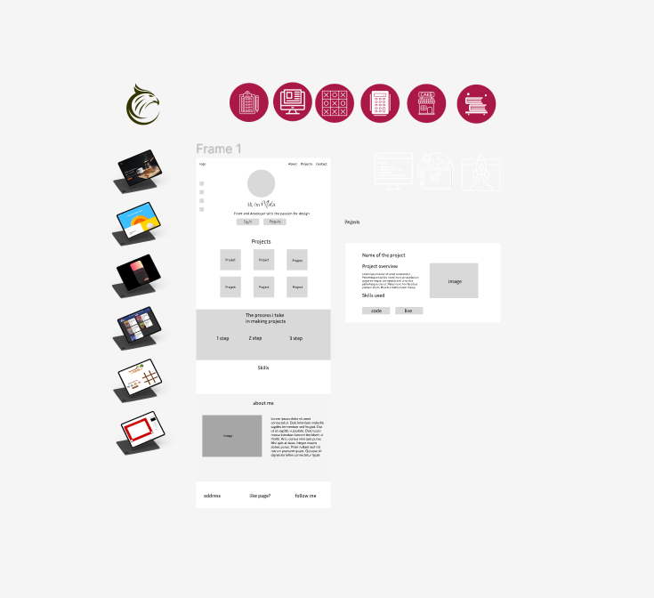

# Portfolio

## Introduction

This is my second portfolio. When my skills advanced I also wanted to change and improve things, that's why I decided to make a new one. I'm very proud of myself how far I've come and excited thinking about how far I still will.

This project was my idea and creation. I started building it from scratch, the code and the design.

This project is build with Sass and is completely responsive. 

Of course I can already see things to upgrade and add, but for now, I will pay attention more on gaining knowledge and building more projects. 

In the portfolio I have a selection of a few projects that I made while learning, most of them need improvement, which I plan on doing. Want to grow and develop my skills even further. 

## Technologies

Skills I used: 
- HTML
- Sass
- JavaScript
- Figma

